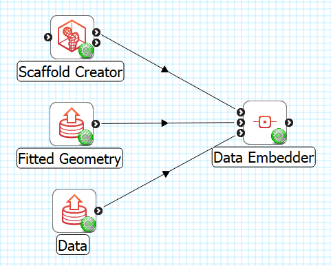
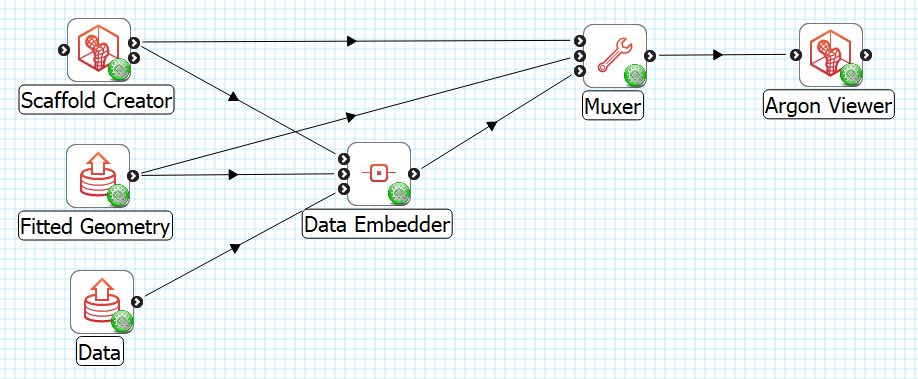
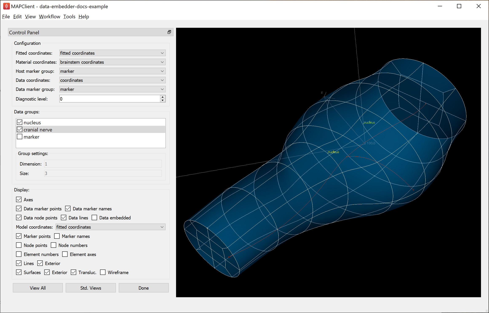
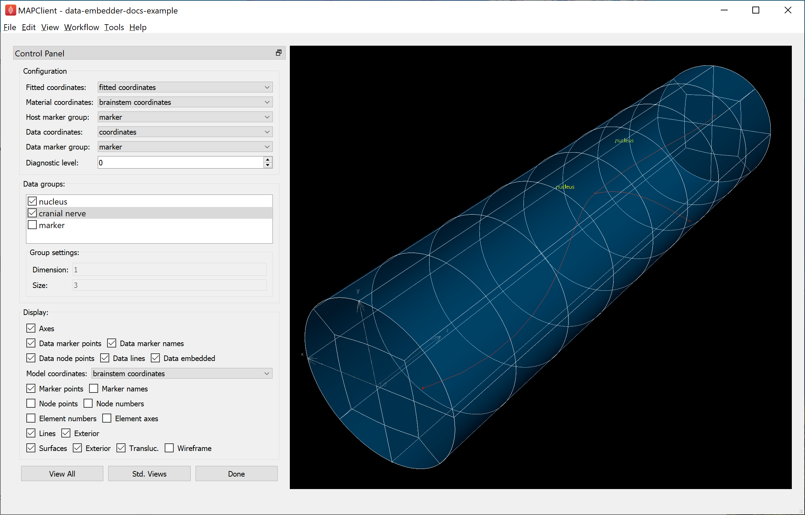
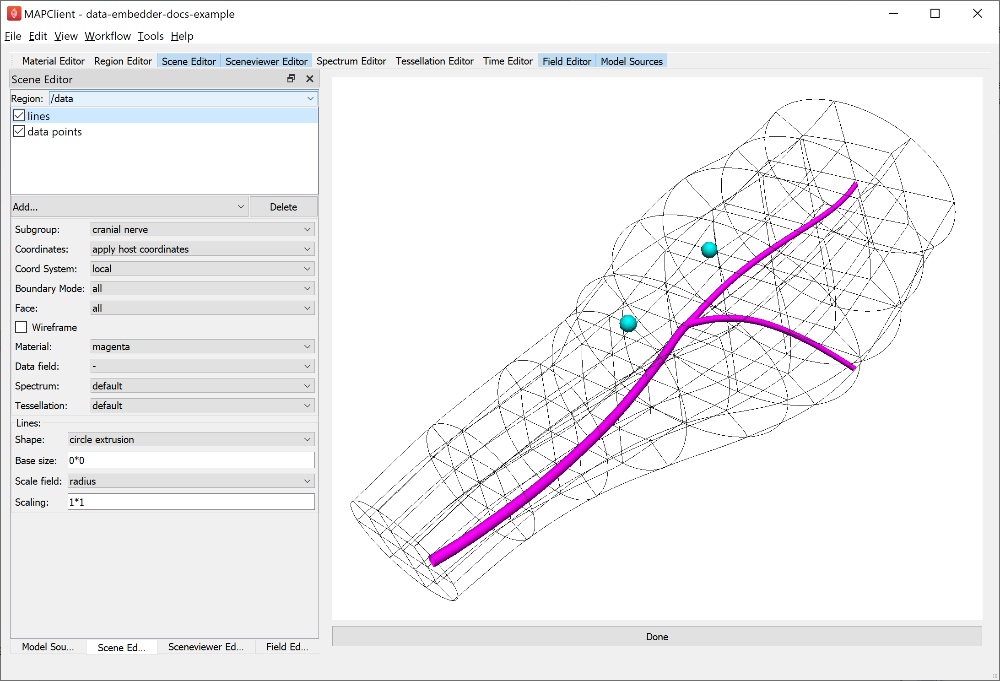
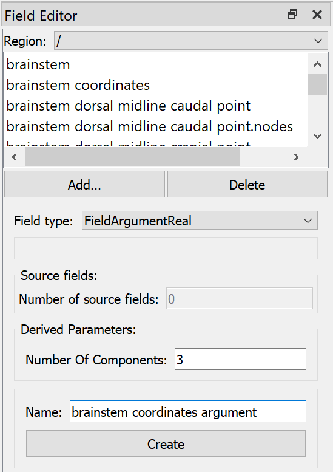
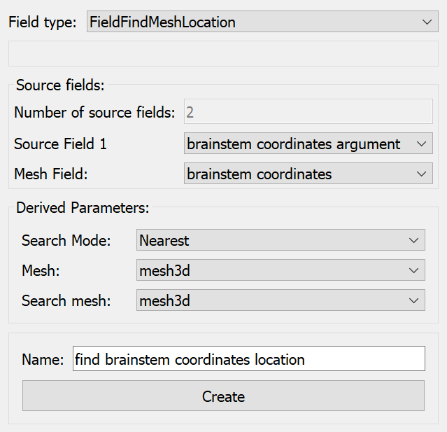
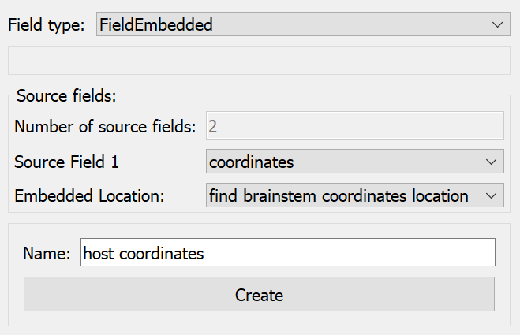
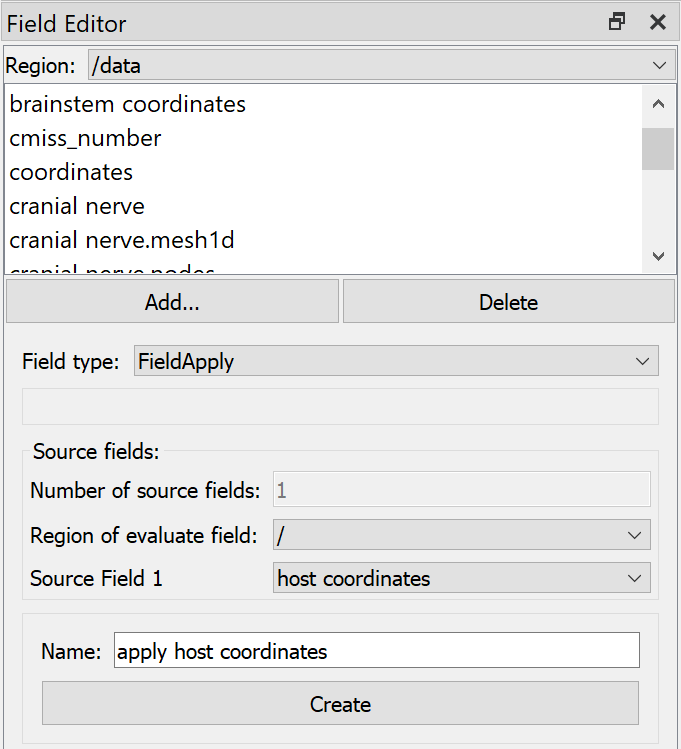
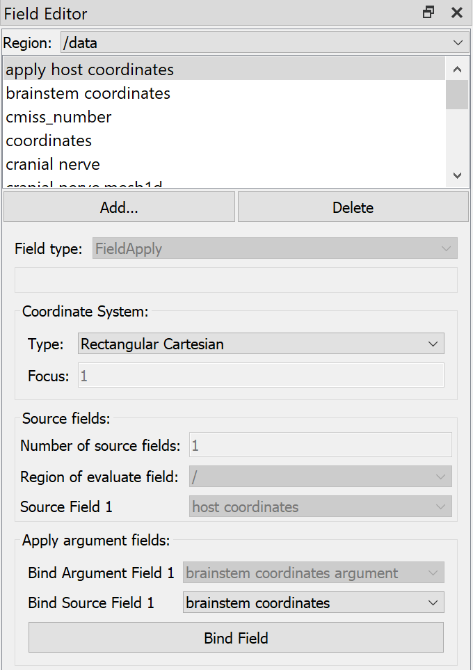

Data Embedder
=============

Overview
--------

The **Data Embedder** tool defines *material coordinates* over data, calculated from its geometric coordinates relative to a fitted scaffold. Hence, a prerequisite for embedding data is that the contour data used for fitting geometry and the data itself are both digitized from the same specimen in the same geometric configuration.

Embedding is the end-result of scaffold/data *registration*. The output of this tool is the chosen measured physiological or other data with locations specified within the scaffold.

This document describes how to set up and use the **Data Embedder** user interface in the Mapping Tools. The actual work is done by the underlying *dataembedder library* which can run it without a user interface, together with the *Zinc library* which handles model representation and computation.

Workflow Connections
--------------------

The workflow connections for **Data Embedder** are shown in :numref:`fig-data-embedder-workflow`:

.. _fig-data-embedder-workflow:

   **Data Embedder** workflow connections.

The tool takes 3 inputs on the left, all *Zinc library* compatible EX files:

1. The generic scaffold defining material coordinates and annotation groups, output from **Scaffold Creator**, or **File Chooser** if read from a file (top input);
2. The fitted geometric field, output from **Geometry Fitter**, or **File Chooser** if read from a file (middle input);
3. The data to embed e.g. a converted `MBF XML file <https://neuromorphological-file-specification.readthedocs.io/en/latest/NMF.html>`_ output by the **MBFXML2EX Converter** tool, or **File Chooser** if read from a file (bottom input).

Note that the input data must be annotated by putting it in named groups. Any objects in the data which are not in a named group are not able to be embedded by this tool.

It produces 1 output, also a Zinc EX file, which may be piped to other workflow steps:

1. The data chosen for embedding with material coordinates defined on it. Note that all other original fields and annotations defined on the chosen data are included in this file. The material coordinates field in the output data matches the name of the scaffold's material coordinates field as chosen in the interface.
   
Whether you use the output in a further workflow step or not, on completion of the workflow step the output is written to a file in the workflow folder under the same name as the step with extension ".exf".

Background
----------

Embedding builds on several model constructs which are recapped here.

A Scaffold defines a space representing all points within it, called its *Domain*. More specifically this is defined as a *Finite Element Mesh*, which is a collection of simple shapes (cubes, wedges, tetrahedra etc. in 3-D) called *Finite Elements* where  "finite" refers to the bounded range of local coordinates in each element. Points within a mesh are uniquely identified by an element and the local coordinates within it. The mesh may hold other information about how elements connect or overlap with each other, so some points in the Domain may be identified by multiple labels.

The Scaffold doesn't look like a real object until a coordinate *Field* is defined over the domain to give it its geometry. A Field over a finite element mesh is a collection of functions mapping the element and local coordinates to some values, and a *Coordinate Field* is a special type which maps to e.g. x, y, z coordinates in a coordinate system, which defines or is consistent with the intended connectivity (and continuity) of the Domain. Commonly, fields are defined by storing parameters at shared points on element boundaries called *Nodes*, and interpolating these values over the elements with polynomial *basis functions* ensures the field is connected and continuous. The images showing scaffolds throughout the Mapping Tools documentation visualize a coordinate field, and the lines show the boundaries of the finite elements.

The mesh element and local coordinates are *material coordinates* meaning they represent permanent labels for the same or equivalent points in the scaffold domain: for an individual, across a population and where possible across multiple species. When fitting the geometric coordinates of a scaffold, every effort is put into smoothly distributing the elements and their coordinates to give a best estimate of where material points would move across and between the contour data used for fitting. When a population of specimens is fitted in this manner, the result is a population of coordinate fields, which can be averaged to give the population mean coordinates. Once material coordinates of a point are known, any other field defined over the host can be evaluated at that same location, including coordinate fields in any configuration, and non-geometric fields.

Embedding can be achieved by directly storing host element and local coordinates over data, but this is of limited use because:

1. It only works for point data, as it's inconvenient to interpolate between host elements to represent higher dimensional embedded domains.
2. It is fixed for a single mesh.

The solution to both issues is to define a standard *material coordinate field* on the scaffold. This is like any other coordinate field but comes with the promise that it is never changed:  locations within its range are material coordinates, and outside of it are not. This is best achieved by first specifying the geometry as an idealized shape for the organ or structure, and then building the scaffold's mesh and material coordinate field to conform with it, taking care to also fix material coordinates for any boundaries between annotated subdomains of it. It's preferable for the material coordinate shape and span to be highly idealized, which makes it easy to document the range of coordinates within it and any of its subdomains if others wish to reuse it. For example, the brainstem's material coordinates is a solid cylinder even though the actual shape is somewhat distorted from this.

Once there is a standard material coordinate field, embedded locations have simple x, y, z (or u, v, w) coordinates within it, and higher dimensional domains such as 1-D nerve networks, interior surfaces or sub-volumes are simply other finite element domains with their coordinate fields interpolated in the same space. This approach also gives independence from the mesh structure and resolution -- a new mesh only needs a field spanning the material coordinates range to work with embedded structures. The mesh then has an intermediary role: embedding mappings take values of the material coordinates on the embedded data, find the location in the mesh with the same material coordinates and can then evaluate any other host field at that location. Note that in the mapping tools these embedding mappings must be *explicitly* defined as described under `Visualization`_ below.

Not all Scaffolds define a material coordinate field, but those that do follow a naming convention of the scaffold/organ name followed by "coordinates", e.g. "brainstem coordinates" for the brainstem scaffold. If an Anatomical Scaffold does not provide a material coordinate field, it is recommended that the default "coordinates" field be used with the unscaled built-in parameters for the species. Note that because the data often also defines a "coordinates" field, the data material coordinates output by **Data Embedder** will be renamed to "material coordinates" in this case, and a warning to this effect is written to the console.

Instructions
------------

To illustrate embedding we will use a `brainstem data embedding example workflow <https://github.com/mapclient-workflows/data-embedder-docs-example>`_ (`download zip <https://github.com/mapclient-workflows/data-embedder-docs-example/archive/refs/heads/main.zip>`_) which uses made-up data consisting of 2 points labelled "nucleus", and a minimal 1-D network labelled "cranial nerve". As an added complication, the cranial nerve network uses cubic Hermite interpolation with discontinuity at branch points, and its derivative parameters are transformed as part of the embedding. The workflow for this example is shown in :numref:`fig-data-embedder-workflow-visualization`:

.. _fig-data-embedder-workflow-visualization:

   **Data Embedder** example workflow with visualization.

This section works through the first part of the workflow up to "Data Embedder"; the remainder is discussed under `Visualization`_.

When first running the workflow, **Scaffold Creator** opens with the chosen brainstem scaffold; click "Done" to move on to data embedding. The main window for **Data Embedder** is shown in :numref:`fig-data-embedder-configuration`:

.. _fig-data-embedder-configuration:

   **Data Embedder** window configuration. The selected "cranial nerve" network is in faint red.

When first run, *Data Embedder* is automatically configured with fields and groups, and selects data groups which are present in the data but not the scaffold, the logic being that contour group and fiducial marker data should have been consumed by the fitting process, and thus should not be embedded. User intervention may be needed to fix these initial settings, and any changes will be remembered for next time it is run.

The *Fitted coordinates* are the field output by **Geometry Fitter** which is usually the original field prefixed with "fitted ", typically "fitted coordinates" or "fitted flat coordinates" if working with flat preparations. The *Material coordinates* field is the material coordinate field defined on the scaffold which is to be defined on the data. *Data coordinates* is the field giving cooordinates for data in the same configuration as the chosen fitted coordinates. The marker groups are usually just "marker". *Diagnostic level*, if raised from 0, writes some diagnosic information in the console when running.

The *Data groups* box lists all the groups present in the data file, with a check mark beside each which shows whether the group is to be embedded. At all times the **Data Embedder** maintains the checked data groups as embedded. Be aware that checking or unchecking a group causes all groups to be re-embedded which can cause a wait for large datasets and/or very detailed scaffolds. The "marker" group is a superset of all marker point data read in, and it's usually redundant to select if the individually named groups of points are selected. Sometimes a dataset contains contour data groups which are not yet defined on the Scaffold, and these will need to be unchecked to avoid embedding them.

Groups are selected by clicking on the name or when the embedding check box is changed, and their corresponding graphics (if checked) are highlighed in red. The "cranial nerve" group is selected in in :numref:`fig-data-embedder-configuration` and :numref:`fig-data-embedder-embedded-brainstem-coordinates`, but is rather hard to see without zooming the browser window (*ctrl-mouse wheel up*) or opening the image in another tab. The *Group information* box lists information about the currently selected group.

The *Display settings* can be changed at any time to turn on or off graphics as for several other mapping tools, with two key differences:

1. The *Model coordinates* changes the coordinates shown on the scaffold, and
2. Checking *Data embedded* engages the embedding mappings to give the value of the host's model coordinates field from the material coordinates calculated on the data.

The *View All* button conservatively resets the view to see the whole model, while *Std. Views* cycles between standard orthographic views of the graphics.

With the *Model coordinates* set to "fitted coordinates", check *Data embedded* and you'll see the cranial nerve move slightly. This happens because the node derivatives are converted to brainstem coordinates using the local deformation gradient at the point, but the interior of the curves are subject to all the deformations of the fitted coordinates relative to the material coordinates. Real data should have more points than this which will make this effect negligible.

With *Data embedded* checked, change *Model coordinates* to "brainstem coordinates" then click *View All* to see what the embedded data looks like in material coordinates, as shown in :numref:`fig-data-embedder-embedded-brainstem-coordinates`:

.. _fig-data-embedder-embedded-brainstem-coordinates:

   **Data Embedder** window showing embedded brainstem coordinates.

Here you can see the brainstem coordinates are a unit radius solid cylinder, 8 units long (from near to far: 3 units "medulla oblongata", 3 units "pons" and 2 units "midbrain"). The "nucleus" points and "cranial nerve" have been assigned "brainstem coordinates" at equivalent material locations to their original coordinates relative to the "fitted coordinates" on the scaffold.

Click *Done* to finish embedding and progress to the next workflow step.

Visualization
-------------

The original generic scaffold, the fitted scaffold geometry and the embedded (registered) data are all sent to a *Muxer* which makes a list of files (configured for 3 of type `http://physiomeproject.org/workflow/1.0/rdf-schema#file_location`) as needed by the Argon Viewer. This runs without user intervention, and the scaffold with embedded data are shown in the general purpose visualization tool **Argon Viewer**, as shown in :numref:`fig-data-embedder-argon-viewer`:

.. _fig-data-embedder-argon-viewer:

   **Argon Viewer** visualization of embedded data in host coordinates.

The **Argon Viewer** step is already set up to display the embedded data, but a few things needed to be set up when it was first run.

Firstly, in the *Region Editor* a child region called "data" was created to read the embedded data into (right click on root region "/", select *Add Child Region*, double click on the child region and rename to "data"). *Regions* are like folders in a file system and form a similar tree structure; separate models can be read into different regions without interfering with each other.

Secondly, in the *Model Sources* dialog, direct the scaffold and fitted geometry to be read into the root region "/", and the data into child region "/data". The data cannot be read into the same region as the scaffold because it uses nodes, elements and fields with overlapping identifiers to the scaffold. It is recommended that you put the host scaffold into a parent region and each separate embedded dataset into a separate named child region.

Graphics showing the scaffold coordinates including element boundaries can then be created in the *Scene Editor* dialog for region "/".

At this point the data only knows where it is in "brainstem coordinates" and we need to define some mappings to show it as embedded in the host scaffold, namely to define the "apply host coordinates" coordinate field chosen in :numref:`fig-data-embedder-argon-viewer`.

Defining embedding mappings
^^^^^^^^^^^^^^^^^^^^^^^^^^^

One of the special features of the *Zinc library* which underlies **Argon Viewer** and many of the other mapping tools, is its ability to not only define interpolated finite element fields such as those read from model files, but to also define fields based on arbitrary math expressions or algorithms as functions of other fields. In **Argon Viewer** these expressions can be created and edited in the *Field Editor*.

The first part of the embedding mapping is to create an "Argument Real" field type representing an unknown material coordinate in the host region. This is done by opening the Field Editor, selecting *Region* "/", clicking *Add...*, choosing *Field type* "Argument Real", setting *Number of components* (3), *Name* ("brainstem coordinates argument"), and clicking *Create* as shown in :numref:`fig-data-embedder-argon-field-editor-argument`.

.. _fig-data-embedder-argon-field-editor-argument:

   **Argon Viewer** Field Editor creating material coordinates argument in host region "/".

Next we define a field finding the host mesh location with the same "brainstem coordinates" as the above argument, searching in the whole 3-D host mesh, and using the nearest point if it goes slightly outside it, as in :numref:`fig-data-embedder-argon-field-editor-find-mesh-location`:

.. _fig-data-embedder-argon-field-editor-find-mesh-location:

   **Argon Viewer** Field Editor creating find mesh location field for material coordinates in host region "/".

Note that the algorithm to find the host mesh location is computationally demanding and it can take some time to build embedded graphics for large datasets.

Next we define a field evaluating the host "coordinates" field at the location found above using an "Embedded" field type (which actually does a type of function composition), as shown in :numref:`fig-data-embedder-argon-field-editor-embedded`:

.. _fig-data-embedder-argon-field-editor-embedded:

   **Argon Viewer** Field Editor creating embedded field evaluating field "coordinates" at found location in host.

To use the above field in the data region requires creating an "Apply" type field, which can evaluate fields from a different region with *argument binding*. As shown in :numref:`fig-data-embedder-argon-field-editor-apply`, we switch to *Region* "/data", *Add...* *Field type* "Apply", select *Region of evaluate field* "/", choose *Source field 1* "host coordinates" (created above), enter a *Name* and click *Create*.

.. _fig-data-embedder-argon-field-editor-apply:

   **Argon Viewer** Field Editor creating Apply field in "/data" region.

The Apply field cannot be evaluated until any "Argument" fields it depends on are bound to actual local fields able to supply values at the desired locations. This is done after creation; the dialog knows the field is a function of *Bind argument field 1* "brainstem coordinates argument" in the host region, and we select *Bind source field 1* "brainstem coordinates" from this region ("/data"), then click *Bind Field*, as in :numref:`fig-data-embedder-argon-field-editor-apply-binding`

.. _fig-data-embedder-argon-field-editor-apply-binding:

   **Argon Viewer** Field Editor binding arguments for Apply field in "/data" region.

The resulting field "apply host coordinates" is now defined on any domain in region "/data" where "brainstem coordinates" is defined, and gives the host coordinates at the embedded location identified by those material coordinates. The result is shown in :numref:`fig-data-embedder-argon-viewer`: the embedded "cranial nerve" and "nucleus" points are shown at the geometric location of host field "coordinates", a configuration the data had never been in.

Additional fields on the host can be evaluated on the data by creating one more "Embedded" field in the host region using the same found location, and one more "Apply" field in each embedded subregion.

Future
------

* This example dataset defines a "radius" field over the "cranial nerve" group which is at the scale of the original data coordinates. In future it is expected that **Data Embedder** will define a corresponding field transformed to the local scale of the material coordinates, enabling similar fields on different specimens to be compared.

* Data can only be embedded within the space of the host domain, and if it's outside, the nearest point on the domain is used. In future it may be possible to maintain embedded locations slightly outside the body. This may help maintain detail in the embedded domain that can't be represented at the resolution of the scaffold mesh.
